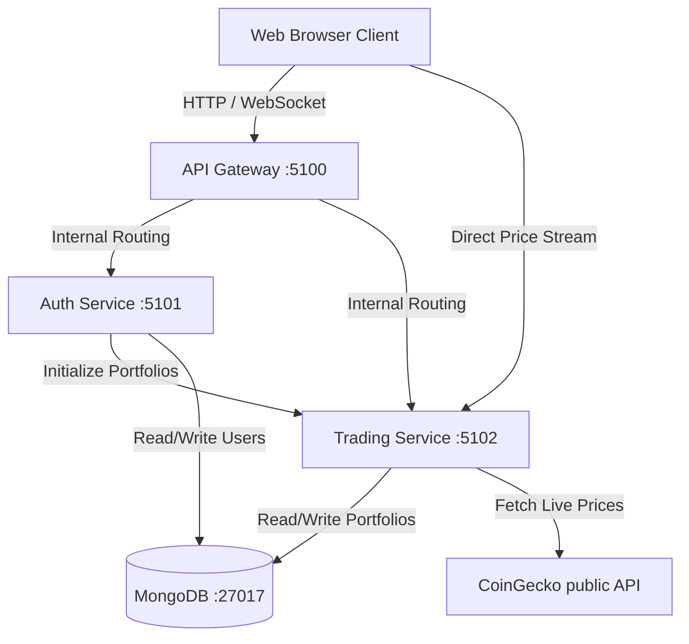

# 🪙 CryptoArena — Real-Time Paper Trading Platform

CryptoArena is a premium, real-time cryptocurrency paper trading simulator built using a modern microservices architecture. It allows users to learn trading, study market patterns, analyze charts, and simulate trades in real-world market conditions with zero financial risk.

---

## 📸 Screenshots
*(Add your 6 screenshots here to show off the beautiful dark-glassmorphic UI!)*

| 1. Landing Portal | 2. Trading Desk |
|:---:|:---:|
|  |  |
| **3. Interactive Charting** | **4. Live Order Book** |
|  |  |
| **5. Portfolio Dashboard** | **6. Transaction History** |
|  |  |

---

## ⚡ Trial Credentials
To try out the platform instantly without registering a new account, use these demo credentials on the Login screen:
* **Email**: `jack01@gmail.com`
* **Password**: `123456`

---

## 🌟 Core Features

1. **Endless Price Ticker**: A smooth, scrolling marquee ticker displaying live crypto rates across the Landing page, Dashboard, and Trading desk.
2. **Interactive Charting**: Seamless TradingView widget integration supporting candlestick charting, indicators, and timeline triggers.
3. **Live Simulated Order Book**: An active matching book simulator updating bids (buys) and asks (sells) every 1.5 seconds around the live market spread rate.
4. **Instant Order Desk**: Buy and sell support with quick-quantity multipliers and live price estimations.
5. **Asset Analytics**: Recharts-powered interactive analytics showing portfolio breakdown and cash distribution.
6. **Transaction Ledger**: A beautiful transaction ledger showing order execution time, prices, quantities, and type tags with slide-up entry animations.

---

## 🏗️ Technical Architecture
The application runs on an isolated microservices network orchestrated by Docker Compose:



---

## 💻 Tech Stack

### Frontend
* **Core**: React 19, Vite, Javascript
* **Styling**: Tailwind CSS 4.0, Vanilla CSS
* **Animations**: Framer Motion
* **Analytics**: Recharts
* **Charting**: TradingView Financial Widgets

### Backend Services
* **Runtime**: Node.js, Express
* **Protocols**: REST API, WebSockets (via `ws` library)
* **API Routing**: HTTP Proxy Middleware (API Gateway)

### Database & Devops
* **Database**: MongoDB (Mongoose ODM)
* **Containerization**: Docker, Docker Compose (volume mapping for persistence)

---

## ⚙️ Quick Start Setup

### Option A: Running with Docker (Recommended)
You must have Docker Desktop installed and running.

1. **Build and start the services**:
   ```bash
   docker compose up --build -d
   ```
2. **Verify containers are running**:
   ```bash
   docker compose ps
   ```
3. **Access the application**:
   Open **`http://localhost:5173`** in your browser to begin trading.

4. **Shutdown the services**:
   * Stop containers (keeps DB data intact): `docker compose down`
   * Stop containers and wipe database state: `docker compose down -v`

---

### Option B: Running Locally (Without Docker)

#### 1. Setup Database
Ensure you have MongoDB running locally, or configure a MongoDB Atlas cloud URI inside the service environment files.

#### 2. Start Auth Service
```bash
cd auth-service
npm install
npm start
```
*Runs on port 5101.*

#### 3. Start Trading Service
```bash
cd trading-service
npm install
npm start
```
*Runs on port 5102.*

#### 4. Start API Gateway
```bash
cd api-gateway
npm install
npm start
```
*Runs on port 5100.*

#### 5. Start Frontend
```bash
cd frontend
npm install
npm run dev
```
*Runs on port 5173.*
