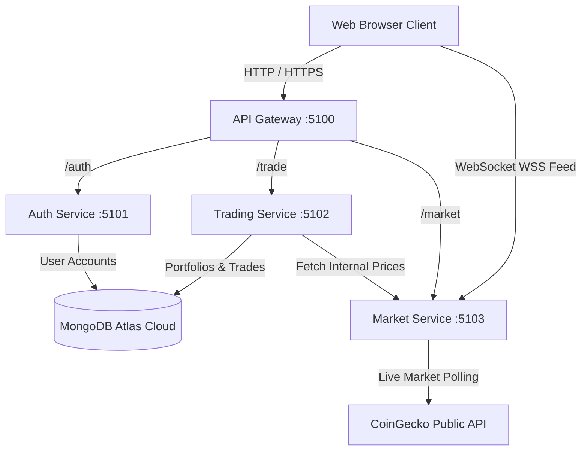

# 🪙 CryptoArena — Real-Time Paper Trading Platform

CryptoArena is a premium, real-time cryptocurrency paper trading simulator built using a modern microservices architecture. It allows users to learn trading, study market patterns, analyze charts, and simulate trades in real-world market conditions with zero financial risk.

---

## 📸 Screenshots
*(Screenshots to show off the beautiful dark-glassmorphic UI!)*

1. Landing Portal
 <br> <br>

2. Trading Desk
 <br> <br>

3. Interactive Charting
 <br> <br>

4. Live Order Book
 <br> <br>

5. Portfolio Dashboard
 <br> <br>

6. Transaction History
 <br> <br>

---

## ⚡ Trial Credentials
To try out the platform instantly without registering a new account, use these demo credentials on the Login screen:
* **Email**: `jack01@gmail.com`
* **Password**: `123456`

---

## 🌟 Core Features

1. **Endless Price Ticker**: A smooth, scrolling marquee ticker displaying live crypto rates across the Landing page, Dashboard, and Trading desk.
2. **Interactive Charting**: Seamless TradingView widget integration supporting candlestick charting, indicators, and timeline triggers.
3. **Live Simulated Order Book**: An active matching book simulator updating bids (buys) and asks (sells) every 1.5 seconds around the live market spread rate.
4. **Instant Order Desk**: Buy and sell support with quick-quantity multipliers and live price estimations.
5. **Asset Analytics**: Recharts-powered interactive analytics showing portfolio breakdown and cash distribution.
6. **Transaction Ledger**: A beautiful transaction ledger showing order execution time, prices, quantities, and type tags with slide-up entry animations.

---

## 🏗️ Technical Architecture
The application runs on an isolated, decoupled microservices network:


```mermaid
graph TD
    Client[Web Browser Client] -->|HTTP / HTTPS| Gateway[API Gateway :5100]
    Client -->|WebSocket WSS Feed| Market[Market Service :5103]
    Gateway -->|/auth| Auth[Auth Service :5101]
    Gateway -->|/trade| Trading[Trading Service :5102]
    Gateway -->|/market| Market
    Auth -->|User Accounts| Atlas[(MongoDB Atlas Cloud)]
    Trading -->|Portfolios & Trades| Atlas
    Trading -->|Fetch Internal Prices| Market
    Market -->|Live Market Polling| Gecko[CoinGecko Public API]
```

---

## 💻 Tech Stack

### Frontend
* **Core**: React, Vite, JavaScript
* **Styling**: Tailwind CSS dark mode system & glassmorphism
* **Animations**: Framer Motion
* **Analytics**: Recharts
* **Charting**: TradingView Financial Widgets
* **Deployment**: Vercel (Global CDN with Git CI/CD)

### Backend Microservices
* **Runtime**: Node.js, Express
* **Protocols**: REST API, WebSockets (`ws` broadcaster engine)
* **API Routing**: HTTP Proxy Middleware (API Gateway)
* **Services**:
  * **API Gateway (`:5100`)**: Single entry point & route proxy
  * **Auth Service (`:5101`)**: Signup, login, bcrypt password hashing & JWT tokens
  * **Trading Service (`:5102`)**: Buy/sell order executions & portfolio calculations
  * **Market Service (`:5103`)**: CoinGecko live price fetcher & WebSocket stream broadcaster
* **Deployment**: Render Cloud Platform (Auto-deploy on Git push with SSL/HTTPS)

### Database & DevOps
* **Database**: MongoDB Atlas Cloud (Mongoose ODM)
* **Containerization**: Docker, Docker Compose

---

## ⚙️ Quick Start Setup

### Option A: Running with Docker Compose (Recommended)
Make sure Docker Desktop is installed and running on your system.

1. **Build and start all microservices**:
   ```bash
   docker compose up --build -d
   ```
2. **Verify running containers**:
   ```bash
   docker compose ps
   ```
3. **Access the application**:
   Open **`http://localhost:5100`** (or `http://localhost:5173` for frontend dev server).

4. **Shutdown services**:
   * Stop containers: `docker compose down`

---

### Option B: Running Locally (Service by Service)

#### 1. Setup Environment
Copy `.env.example` to `.env` in each service folder and configure your MongoDB Atlas URI & JWT secret.

#### 2. Start Auth Service (:5101)
```bash
cd auth-service
npm install
npm start
```

#### 3. Start Trading Service (:5102)
```bash
cd trading-service
npm install
npm start
```

#### 4. Start Market Service (:5103)
```bash
cd market-service
npm install
npm start
```

#### 5. Start API Gateway (:5100)
```bash
cd api-gateway
npm install
npm start
```

#### 6. Start Frontend (:5173)
```bash
cd frontend
npm install
npm run dev
```
